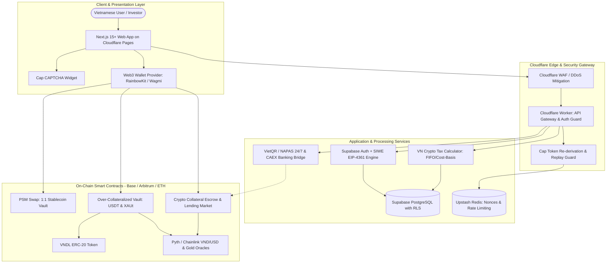
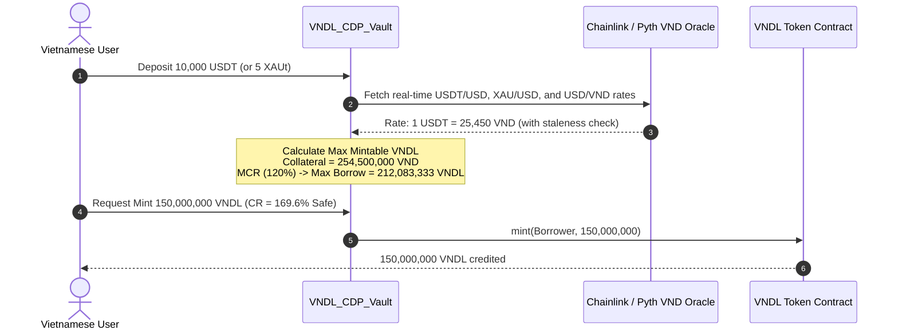
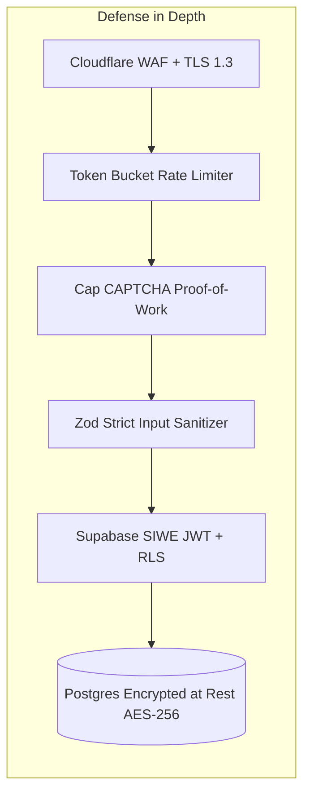

# VietDeFi (VND-X): Architecture Blueprint & Execution Game Plan

An enterprise-grade, regulation-ready decentralized financial ecosystem and Web3 gateway tailored for the Vietnamese digital asset economy.

---

## 1. Executive Blueprint & System Scope

VietDeFi (VND-X) is designed as a hybrid non-custodial Web3 financial protocol and compliance portal for Vietnamese cryptocurrency investors, traders, and institutions. The platform operates across four core pillars:

```
                           ┌────────────────────────────────────────┐
                           │         VietDeFi (VND-X) Portal        │
                           └───────────────────┬────────────────────┘
                                               │
         ┌─────────────────────┬───────────────┴───────────────┬─────────────────────┐
         ▼                     ▼                               ▼                     ▼
┌─────────────────┐   ┌─────────────────┐             ┌─────────────────┐   ┌─────────────────┐
│   Pillar 1:     │   │   Pillar 2:     │             │   Pillar 3:     │   │   Pillar 4:     │
│ 1:1 Stable Swap │   │  VNDL Stablecoin│             │ Vietnam Lending │   │ Vietnam Crypto  │
│ (USDT/USDC/     │   │  (Pegged to VND,│             │ & Borrow Market │   │ Tax & Reporting │
│  PYUSD/USDG)    │   │  USDT/XAUt CDP) │             │ (Crypto <-> VND)│   │  (NQ 05 & PIT)  │
└─────────────────┘   └─────────────────┘             └─────────────────┘   └─────────────────┘
```

1. **1:1 Stablecoin Swap (Peg Stability Module - PSM)**: Zero-slippage, micro-fee (0.02% - 0.04%) liquidity pool facilitating instantaneous swapping between top institutional and retail dollar-pegged stablecoins (USDT, USDC, PayPal USD - PYUSD, and Paxos USDG).
2. **VNDL Stablecoin (VND-Pegged Collateralized Debt Position)**: A decentralized stablecoin strictly pegged to 1 Vietnamese Dong (1 VNDL = 1 VND), minted through over-collateralized vaults backed by Tether USD (USDT) and Tether Gold (XAUt), maintained via real-time Chainlink/Pyth forex oracles and automated Dutch auction liquidations.
3. **Vietnamese Dual-Track Lending & Borrowing Market**:
   - **Supply / Lend**: Deposit crypto assets (USDT, USDC, BTC, ETH) to earn high-yield interest paid directly in VND (via VNDL on-chain or automated VietQR/NAPAS 24/7 bank transfer).
   - **Borrow**: Lock collateral (BTC, ETH, XAUt) to draw instant VND cash loans without selling underlying crypto, safeguarding tax-free liquidity for real-world spending in Vietnam.
4. **Automated Vietnam Crypto Tax & Regulatory Suite**: Calculation engine and reporting portal aligned with the Vietnamese Ministry of Finance, General Department of Taxation, and **Resolution 05/2025/NQ-CP**. Supports FIFO, Specific Identification, and Weighted Average cost-basis methods; exports standardized filing forms (e.g. Form 02/KK-TNCN) and maintains immutable audit trails conforming to **Decree 13/2023/NĐ-CP** (Personal Data Protection).

---

## 2. Infrastructure & Provider Strategy

### 2.1 Cloudflare (Pages, Workers, WAF & Zero Trust)
- **Cloudflare Pages**: Hosts the Next.js 15+ frontend application across Cloudflare's 330+ global edge data centers for sub-20ms first-contentful paint in Ho Chi Minh City and Hanoi.
- **Cloudflare Workers**: Serves as the ultra-low latency Edge API Gateway handling rate limiting, request validation, Cap CAPTCHA verification, and caching without server cold starts.
- **Edge Security & TLS**: Cloudflare Advanced WAF with DDoS mitigation, TLS 1.3 enforcement, DNSSEC, automatic Let's Encrypt / Google Trust Services 90-day certificate rotation, and strict HTTP Strict Transport Security (`Strict-Transport-Security: max-age=63072000; includeSubDomains; preload`).

### 2.2 Supabase (Managed Postgres, Auth, Realtime & Storage)
- **Database**: Dedicated PostgreSQL 16+ instance configured with Row-Level Security (RLS) across every table to guarantee complete multi-tenant data isolation.
- **Authentication**: Hybrid authentication model combining **Sign-In with Ethereum (SIWE - EIP-4361)** for Web3 native wallets (MetaMask, Rabby, OKX, Phantom) and OAuth/Magic Links for non-crypto users, mapped to unified user identities.
- **Realtime**: WebSockets engine broadcasting live oracle price updates, order book changes, lending APR fluctuations, and transaction liquidation warnings.
- **Encrypted Storage**: Client-side AES-256 encrypted storage buckets for user KYC identity records, national citizen identity cards (CCCD), and generated official tax audit reports.

### 2.3 Vietnamese Regulatory Exchanges & Fiat Gateways (CAEX & SCEX)
- **CAEX Context (caex.com.vn)**: Vietnam Prosperity Crypto Assets Exchange (Cổ phần Sàn giao dịch Tài sản mã hóa Việt Nam Thịnh Vượng), licensed under the pilot regulatory sandbox of **Resolution 05/2025/NQ-CP**, in strategic partnership with HashKey and VPBank Securities (VPBankS).
- **SCEX Context (scex.com.vn)**: Saigon Digital / Commodity Exchange initiative.
- **Integration Approach for VietDeFi**:
  - **Tier 1 (Non-Custodial DeFi)**: User interacts directly with smart contracts via self-custody wallet for on-chain swaps, VNDL minting, and lending.
  - **Tier 2 (Regulated Fiat On/Off-Ramp)**: Integrates with CAEX sandbox liquidity endpoints or authorized Vietnamese open banking APIs (VPBank Open Banking / VietQR NAPAS 24/7 payment rails) for automatic VND fiat settlement to/from domestic Vietnamese bank accounts (Vietcombank, Techcombank, VPBank, MBBank).

### 2.4 Cap (Self-Hosted Open-Source CAPTCHA - trycap.dev)
Per `https://trycap.dev/prompt.md`, Cap provides an auditable, privacy-preserving, zero-tracking CAPTCHA with proof-of-work and browser instrumentation, ideal for financial grade bot prevention without sending user data to third parties.

#### Architectural Choice: Cap Core (`capjs-core`) vs Standalone Server
| Feature | Cap Standalone | Cap Core (`capjs-core`) **[Recommended]** |
| :--- | :--- | :--- |
| **Infrastructure** | Requires Docker container + Valkey/Redis instance | Embedded directly into backend / Edge Workers |
| **Latency** | Network hop to Cap server | In-process cryptographic execution (< 2ms) |
| **Secrets** | Admin Key, Site Key, Secret Key | Single 32+ byte signing secret (`CAP_SECRET`) |
| **CORS** | Requires CORS configuration | Same origin (`/cap/challenge`, `/cap/redeem`) |

#### Implementation Plan for Cap Core:
1. **Dependency Installation**: `npm install capjs-core` in `@vietdefi/edge-api`.
2. **Secret Provisioning**: 64-character cryptographically secure key `CAP_SECRET` stored in Cloudflare Worker Secrets / Doppler.
3. **Endpoints Architecture**:
   - `POST /api/cap/challenge`: Calls `generateChallenge(SECRET, { scope: "auth_and_tx", instrumentation: true })`.
   - `POST /api/cap/redeem`: Calls `validateChallenge(...)` with atomic replay protection in Upstash Redis / Cloudflare KV via `consumeNonce`.
4. **Verification Gate**: Server-side fail-closed token validation on signup, login, loan origination, and tax report generation before database or contract side-effects.
5. **Frontend Widget**: `<cap-widget data-cap-api-endpoint="/api/cap/">` embedded seamlessly into auth modals and swap approval forms.

---

## 3. High-Level System Architecture Diagram



---

## 4. Smart Contract Architecture (Web3 Core)

### 4.1 VNDL Stablecoin & Over-Collateralized CDP Engine
The VNDL token is an ERC-20 compliant stablecoin pegged 1:1 to the Vietnamese Dong ($1 \text{ VNDL} = 1 \text{ VND}$).



#### Key Parameters:
| Collateral Asset | Min Collateral Ratio (MCR) | Liquidation Ratio | Liquidation Penalty | Stability Fee (APR) |
| :--- | :--- | :--- | :--- | :--- |
| **USDT (Tether USD)** | 120% | 110% | 6.5% | 2.5% |
| **XAUt (Tether Gold)**| 140% | 125% | 8.0% | 3.0% |

#### Liquidation Mechanism:
1. **Health Factor ($HF$)**: $HF = \frac{\sum (\text{Collateral Value in VND} \times \text{Liquidation Threshold})}{\text{Total Borrowed VNDL Debt}}$.
2. If $HF < 1.0$, the vault enters liquidation status.
3. Liquidators repay the outstanding VNDL debt in exchange for collateral plus the liquidation penalty via Dutch auction or direct Stability Pool absorption.

### 4.2 1:1 Stablecoin Swap (Peg Stability Module - PSM)
- Supports **USDT, USDC, PYUSD, and USDG**.
- Pricing Curve: 1:1 constant-sum invariant ($x + y = k$) modified with dynamic reserve buffer caps to prevent toxic debt exposure in black swan depegging events.
- Protocol Fee: 0.02% base fee (split: 50% to VNDL stability reserve, 50% to treasury).
- Circuit Breaker: Automated halt if external Chainlink oracle reports any stablecoin deviating beyond $\pm 1.5\%$ from $1.00 USD.

### 4.3 Lending & Borrowing Market for Vietnamese Users
- **Lend Crypto $\rightarrow$ Earn VND Yield**:
  - Users deposit USDT/ETH/BTC into lending pools.
  - Borrowers pay borrowing interest in VNDL/VND.
  - Suppliers receive yields benchmarked to Vietnamese interbank interest rates + crypto liquidity premium (typically 7.5% - 11.5% APY).
- **Collateralized VND Borrowing**:
  - Deposit BTC/ETH as collateral $\rightarrow$ instantly draw VNDL on-chain or request direct VND fiat transfer into domestic bank accounts via verified P2P escrow agents / CAEX fiat gateway.
  - Zero credit checks, 100% backed by cryptographic collateral.

---

## 5. Vietnam Crypto Tax Engine & Regulatory Compliance

### 5.1 Legal & Regulatory Framework Alignment
VietDeFi's tax and identity architecture is engineered around the Vietnamese legal landscape:
1. **Resolution 05/2025/NQ-CP (Nghị quyết 05/2025/NQ-CP)**: National framework pilot on digital asset management, crypto exchange sandbox licensing, and investor protection.
2. **Decree 13/2023/NĐ-CP (Nghị định 13/2023/NĐ-CP)**: Personal Data Protection Decree (PDPD). Enforces explicit user consent, strict data retention limits, right to data erasure, cross-border data transfer impact assessments, and encryption standards.
3. **Law on Anti-Money Laundering (2022)** & **Decree 52/2013/NĐ-CP**: Tiered KYC/KYB threshold enforcement for domestic financial activities.

### 5.2 Tax Computation Algorithms
The Vietnamese tax engine calculates Personal Income Tax (PIT - Thuế TNCN) from capital investment and asset transfers:
- **Cost-Basis Methodologies**:
  - **FIFO (First-In, First-Out)**: Default standard for tax authorities.
  - **Specific Identification**: For institutional/whale portfolios.
  - **Weighted Average**: For active high-frequency traders.
- **Taxable Events**: Crypto-to-crypto swaps, crypto-to-fiat exits, lending yield distributions, and collateral liquidation events.
- **Reporting Outputs**: Automated generation of tax summary schedules, capital gains/loss worksheets, and pre-filled Form 02/KK-TNCN in PDF/Excel format ready for submission to local tax sub-departments.

---

## 6. Frontend, SEO, CRO & UX Specifications

### 6.1 Critical Site Pages & Conversion Architecture
- **CTA Above the Fold (Hero Section)**:
  - High-impact headline: *"Nền Tảng Tài Chính Số & Thuế Crypto Đầu Tiên Tại Việt Nam"*.
  - Instant Interactive Swap & Borrow Widget right in the viewport.
  - Immediate dual actions: `[ Kết Nối Ví (Web3) ]` and `[ Trải Nghiệm Tính Phí Thuế Miễn Phí ]`.
- **Custom 404 Page (`/not-found.tsx`)**:
  - Branded, sleek dark-mode glassmorphic interface.
  - Quick navigation shortcuts: 1:1 Stablecoin Swap, VNDL Vaults, Lending Market, Tax Guide.
  - Interactive search bar to redirect lost users.
- **Thank You / Transaction Success Page (`/tx/[hash]` & `/thank-you`)**:
  - Real-time transaction state visualizer (Submitted $\rightarrow$ Validated on-chain $\rightarrow$ Indexed).
  - Downloadable official PDF receipt with transaction hash, timestamp, and gas fee breakdown for accounting.
  - Shareable social proof snippet with referral link.
- **Internal Linking Network**:
  - Deep-linking web connecting core product actions to educational resources: *VNDL Whitepaper*, *Hướng Dẫn Thuế Crypto Nghị Quyết 05*, *So Sánh Lãi Suất Cho Vay Crypto*, *Tài Liệu Bảo Mật & Kiểm Toán*.

### 6.2 Advanced Technical SEO & Meta Framework
- **Dynamic `sitemap.xml`**: Automatically indexed routes with `<priority>` and `<changefreq>` tags.
- **Strict `robots.txt`**: Allowing Googlebot, Bingbot, and localized crawlers while disallowing private user dashboards (`/dashboard/*`, `/api/*`).
- **Semantic Metadata per Route**:
  - Unique page titles: `VND-X | Đổi Stablecoin 1:1 USDT, USDC Không Trượt Giá`, `VND-X | Vay Tiền Đồng Thế Chấp Crypto & Vàng XAUt`.
  - Comprehensive Open Graph (OG) tags, Twitter Cards, and canonical URLs.
  - **Schema.org Structured Data (JSON-LD)**:
    - `Organization` (Company identity, support channels).
    - `FinancialProduct` (VNDL token, stablecoin swap terms, lending APRs).
    - `SoftwareApplication` (Vietnamese Crypto Tax Calculator).
    - `FAQPage` (Schema-compliant FAQ for instant rich snippets in Google search results).

---

## 7. Enterprise Security, Resilience & SRE Protocols



### 7.1 Security & Access Control Matrix
- **Input Sanitization & Injection Prevention**: Universal schema parsing via Zod across all API routes; HTML/Markdown output sanitized through DOMPurify; parameterized SQL through Supabase PostgREST preventing SQL injection.
- **Authentication & Token Expiry**:
  - EIP-4361 Sign-In with Ethereum (SIWE) nonce challenge.
  - Short-lived JWT access tokens (15-minute TTL) paired with cryptographically rotated refresh tokens stored strictly in `HttpOnly; Secure; SameSite=Strict` cookies.
  - MFA via TOTP and WebAuthn (FIDO2 / Passkeys).
- **Secrets Management**: Zero plain-text credentials in repository; Doppler secrets orchestration synchronized to Cloudflare Worker Secrets and GitHub Actions CI.
- **Rate Limiting & Abuse Prevention**:
  - Cloudflare edge rate limiting (100 req/min/IP).
  - Upstash Redis sliding-window algorithm for sensitive financial APIs (10 req/min for quote/swap requests).
  - Cap CAPTCHA challenge mandatory on authentication and sensitive mutations.
- **Multi-Tenancy & Data Isolation**: Database-level PostgreSQL Row-Level Security (RLS) policies enforcing `WHERE user_id = auth.uid()` on all queries.
- **Audit Trails & Tamper-Evident Logging**: Cryptographically linked audit logs (SHA-256 hash-chaining) capturing all balance changes, administrative interventions, and tax calculations with immutable timestamps.

### 7.2 Reliability, Resilience & Disaster Recovery
- **Error Handling & Graceful Degradation**: Microservices fail gracefully with cached quotes; UI provides actionable Vietnamese error toasts.
- **Circuit Breakers & Oracles**: Dual oracle consensus (Chainlink + Pyth). If price discrepancy exceeds 2% or data is stale (> 300 seconds), minting/borrowing halts automatically.
- **Retry Logic & Idempotency**:
  - Exponential backoff with full jitter on all external Web3 RPC and banking API requests.
  - `Idempotency-Key` (UUIDv4) required on all financial POST requests, cached in Redis with a 24-hour TTL to prevent double-spending or duplicate loan mints.
- **RTO & RPO Objectives**:
  - **RTO (Recovery Time Objective)**: $< 15\text{ minutes}$ via automated container re-deployment and Cloudflare edge rerouting.
  - **RPO (Recovery Point Objective)**: $< 1\text{ minute}$ via Supabase continuous WAL (Write-Ahead Logging) archiving and Point-in-Time Recovery (PITR).

---

## 8. Architecture Decision Records (ADRs)

### ADR 001: Next.js 15+ on Cloudflare Pages vs Containerized Node.js Monolith
- **Status**: Accepted
- **Context**: VietDeFi requires global low latency, extreme DDoS resilience, and zero server maintenance overhead.
- **Decision**: Deploy Next.js App Router on Cloudflare Pages using edge runtime and Workers for API routing.
- **Consequences**: Instant edge delivery, zero server provisioning, seamless scalability during viral market spikes.

### ADR 002: Supabase with Hybrid SIWE (EIP-4361) & PostgreSQL Row-Level Security
- **Status**: Accepted
- **Context**: Need to support Web3 native self-custody wallets alongside Web2 credentials while enforcing strict multi-tenancy.
- **Decision**: Authenticate wallet signatures via EIP-4361, map Ethereum public keys to Supabase Auth UUIDs, and enforce multi-tenancy at the database engine level via PostgreSQL RLS.
- **Consequences**: Eliminates application-layer authorization bypass bugs; database inherently refuses cross-tenant data leaks.

### ADR 003: Cap Self-Hosted CAPTCHA vs Cloudflare Turnstile / Google reCAPTCHA
- **Status**: Accepted
- **Context**: Need privacy-respecting bot protection compliant with Vietnam Decree 13/2023/NĐ-CP and GDPR without third-party data tracking.
- **Decision**: Integrate Cap Core (`capjs-core`) directly into our edge backend with server-side validation.
- **Consequences**: User data never leaves our sovereign infrastructure; zero ongoing per-request fees; frictionless proof-of-work UX.

### ADR 004: VNDL Pegging via Over-Collateralized Multi-Asset CDP Vaults
- **Status**: Accepted
- **Context**: Algorithmic stablecoins (like Terra UST) carry systemic depeg collapse risks. A Vietnamese stablecoin requires rock-solid backing.
- **Decision**: Back VNDL exclusively with battle-tested over-collateralized assets (USDT for fiat parity, XAUt for gold-standard inflation hedging) using MakerDAO/Liquity-inspired liquidation dynamics.
- **Consequences**: Absolute solvency transparency verifiable 24/7 on-chain; zero unbacked minting risk.

---

## 9. Phased Implementation Game Plan & Milestones

```
Phase 1: Foundation & Infrastructure (Weeks 1 - 2)
├── Repository setup (TurboRepo monorepo)
├── Cloudflare Pages & Worker Edge Gateway
├── Supabase Schema, Migrations & RLS Policies
├── Cap Core integration (endpoints & widget)
└── Design system & responsive layout (Dark/Light mode)

Phase 2: Smart Contract & Core Protocols (Weeks 3 - 5)
├── VNDL ERC-20 token contract
├── Over-collateralized CDP Vault (USDT/XAUt backing)
├── PSM 1:1 Stablecoin Swap Engine
├── Chainlink & Pyth Oracle connectors with circuit breakers
└── Foundry test suite (unit tests, fuzzing, invariant tests)

Phase 3: Lending Market & Fiat Gateway (Weeks 6 - 8)
├── Collateral escrow and lending smart contracts
├── Dual-track interest calculation engine
├── VietQR & NAPAS 24/7 payment integration specs
└── CAEX Sandbox API bridge / P2P escrow matching

Phase 4: Vietnam Crypto Tax Engine & Compliance (Weeks 9 - 10)
├── FIFO / Specific Identification / Weighted Average tax engine
├── Resolution 05/2025/NQ-CP & Decree 13 compliance framework
├── Automated Form 02/KK-TNCN PDF/Excel exporter
└── Encrypted audit trail and tamper-evident hash logging

Phase 5: SEO, Conversion, Testing & Mainnet Launch (Weeks 11 - 12)
├── Custom 404, Thank You page, Sitemap, robots.txt, Schema.org
├── Playwright E2E test suite & k6 load testing (10,000 RPS)
├── Third-party smart contract security audit
└── Mainnet deployment on Arbitrum / Base & Community Beta
```
